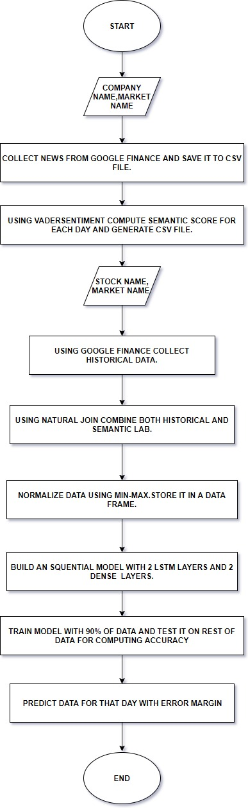
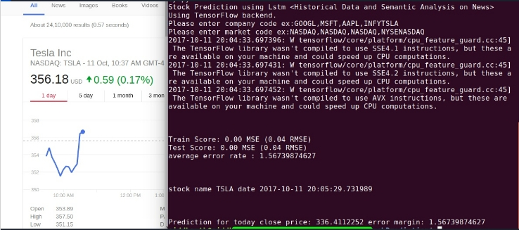
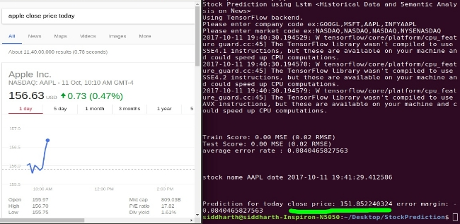
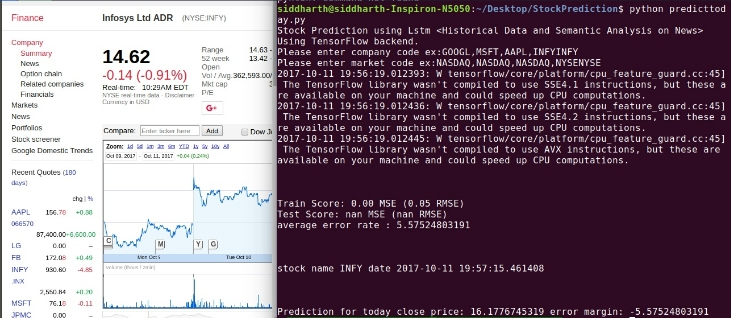

# StockPrediction
Getting Stock Historical Data from Google Finanace
Getting Stock Related news from Google Finance News
Using VaderSentiment to calculate semantic score for each day.

VaderSentiment=>https://github.com/cjhutto/vaderSentiment

Using LSTM with 4 hidden layers and 
optimisation technique "ADAMS"=>https://github.com/fchollet/keras/blob/master/keras/optimizers.py#L385

## Order Of execution:-

1. Parse.py=> provide proper company code and market name ex:MSFT,NASDAQ;INFY,NYSE;It generates a csv file with all news

2. Test1.py=>combines all news for a particular day

3. list.py=>calculates semantic score for each day

4. predicttoday.py

*note:parse.py,list.py,test1.py are in folder semantic*

See results section to see the accuracy we have got for stocks of various companies various companys.

## Dependencies

1. keras
2. tensorflow
3. matplotlib
4. pandas
5. theanos
6. urllib
7. FeedParser

## Methodology

## Results

## References
1. https://machinelearningmastery.com/time-series-prediction-lstm-recurrent-neural-networks-python-keras/
2. https://keras.io/

